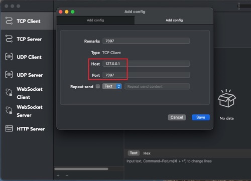

## BIO
1. 启动 [BIOServer](./src/main/java/cc/tianbin/demo/netty/bio/server/BIOServer.java)
2. 打开 [Socket Debugger](https://apps.apple.com/us/app/socket-debugger/id1547933097)，添加 TCP Client  
    127.0.0.1  
    7397
    
3. 启动 TCP Client，与 BIO Server 互动。
    

4. 或直接启动 [BIOClient](./src/main/java/cc/tianbin/demo/netty/bio/client/BIOClient.java)，自动交互。

注意 每句话的后面要加个 \n，因为 [ChannelAdapter#run()](./src/main/java/cc/tianbin/demo/netty/bio/ChannelAdapter.java) 方法里 是一行一行读的数据

## NIO

client 和 server 互动，不再需要 \n. 因为 NIO 是通过 Selector 轮训处理的所有请求 

## AIO

bug: client 发过去的第1条消息，服务端没接收到。。。