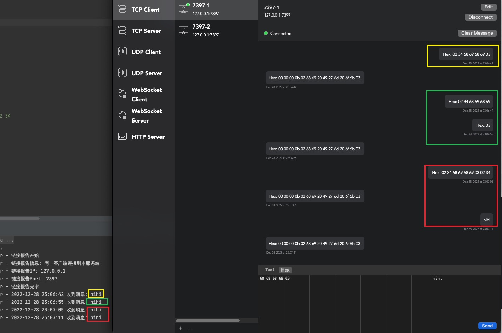

## 自定义编码器解码器，处理半包、粘包数据

> 数据传输过程中有各种情况；整包数据、半包数据、粘包数据，比如我们设定开始符号02、结束符号03； 整包数据；02 89 78 54 03 半包数据；02 89 78 粘包数据；02 89 78 54 03 02 89

[MyEncoder](./src/main/java/cc/tianbin/demo/netty/codec/MyEncoder.java)  
[MyDecoder](./src/main/java/cc/tianbin/demo/netty/codec/MyDecoder.java)  


```
第一组；整包测试数据：
02 34 68 69 68 69 03

第二组；半包测试数据
02 34 68 69 68 69
03

第三组：粘包测试数据
02 34 68 69 68 69 03 02 34
68 69 68 69 03
```

