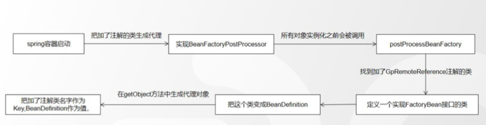

## 1. netty-rpc-api 
mvn install

把项目发布到本地的mvn

## 2. netty-rpc-provider
编写 UserServiceImpl，实现 IUserService

## 3. netty-rpc-consumer

创建一个 UserController，消费 IUserService

## 4. netty-rpc-protocol

### 4.1 定义报文格式
cc.tianbin.demo.netty.rpc.protocol.core

### 4.2 实现序列化
[SerializerFactory](./netty-rpc-protocol/src/main/java/cc/tianbin/demo/netty/rpc/protocol/serial/SerializerFactory.java)

### 4.3 实现编码器和解码器
cc.tianbin.demo.netty.rpc.protocol.code
 - RpcDecode
 - RpcEncode

### 4.4 利用 spring AOP，代理 RemoteReference 接口

把加了 @RemoteReference 注解的 IUserService 生成代理。

[SpringRpcReferencePostProcessor](./netty-rpc-protocol/src/main/java/cc/tianbin/demo/netty/rpc/protocol/spring/reference/SpringRpcReferencePostProcessor.java), 实现 postProcessBeanFactory 方法  
-> [SpringRpcReferenceBean](./netty-rpc-protocol/src/main/java/cc/tianbin/demo/netty/rpc/protocol/spring/reference/SpringRpcReferenceBean.java)  
-> [RpcInvokerProxy](./netty-rpc-protocol/src/main/java/cc/tianbin/demo/netty/rpc/protocol/spring/reference/RpcInvokerProxy.java)  
// 通过报文的格式封装数据，通过netty传输数据到服务端  
-> [NettyClient](./netty-rpc-protocol/src/main/java/cc/tianbin/demo/netty/rpc/protocol/netty/NettyClient.java)

### 4.5 收到数据后，解析报文，获取到 header 和 body 数据，body 中有类名和方法名 

[NettyServer](./netty-rpc-protocol/src/main/java/cc/tianbin/demo/netty/rpc/protocol/netty/NettyServer.java)

### 4.6 服务端启动会把加了 RemoteService 注解的类都被注册到容器中，后面可以根据 key 获取实例
[SpringRpcProviderBean](./netty-rpc-protocol/src/main/java/cc/tianbin/demo/netty/rpc/protocol/spring/service/SpringRpcProviderBean.java)

通过类名和方法获取到对象，然后反射调用方法，然后向客户端返回数据
[Mediator.processor](./netty-rpc-protocol/src/main/java/cc/tianbin/demo/netty/rpc/protocol/spring/service/Mediator.java)